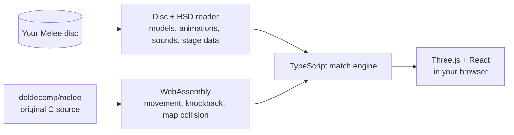

<div align="center">

# Smash Web

**Super Smash Bros. Melee in the browser, built from the original game data.**

[**▶ Play now**](https://smashw.com/play) · [Discord](https://discord.gg/xSczUy8e5) · [How it works](#how-it-works) · [Run your own](#run-your-own-server)


</div>

Smash Web is a non-profit fan port of Melee for the web. It reads models, animations, stages, sounds and fighter data from **your own** Melee disc, and runs selected original C routines from the [Melee decompilation](https://github.com/doldecomp/melee) as WebAssembly. Nothing from the game is stored in this repository.

It is a work in progress, not the complete Melee engine. See [what's missing](#whats-missing).

## Play

1. Open **[smashw.com/play](https://smashw.com/play)**.
2. Pick your Melee disc image (USA v1.02 `.iso`). It is read on your device and never uploaded.
3. Choose a mode and fight.

It runs in desktop and mobile browsers with keyboard, touch or a gamepad. For controllers paired to a phone there is an [Android app](docs/ANDROID.md).

## What's in

- **Fighters:** all 26 Melee characters. Add the ACE 2.0 disc for 31 more [ACE fighters](docs/characters/ACE_FIGHTERS.md) (Sonic, Wolf, Zero, Chun-Li…).
- **Stages:** 19 original stages with their music.
- **Modes:** solo and local (2–8 players, CPU levels 1–9), online rooms (2–8 browsers), tournaments, King of the Hill, Zombies, Roulette Chaos and the Rift Descent roguelike.
- **Extras:** rebindable keys, gamepad profiles, touch controls, accounts with cloud saves, party voice chat and [custom character packs](docs/characters/CUSTOM_CHARACTERS.md).

## How it works



- **Original code, unchanged.** The build copies 33 movement, jump, hitlag and knockback routines, plus Melee's map collision (`mpcoll.c`, `mplib.c`), byte for byte from a pinned decomp commit. It hashes every function and refuses to build from a modified checkout.
- **Original data.** Fighter attributes, hitboxes, animation scripts, stage collision and blast zones are read from the disc at runtime.
- **TypeScript for the rest.** Match flow, specials, items, CPU opponents, netcode, rendering and UI. Every fighter is TypeScript on top of the shared WebAssembly physics.
- **Online** uses a central WebSocket relay. Each browser simulates the match with bounded prediction and rollback, and peers compare confirmed state hashes.

More detail: [docs/ARCHITECTURE.md](docs/ARCHITECTURE.md).

## What's missing

- DI and SDI, move staling, powershields and light shields.
- Melee's full ECB collision. The original map collision only covers grounded fighters on Final Destination and Battlefield.
- The full particle/TEV renderer and the AX sound mixer; approximations are used instead.
- Some specials and states still use prototype code around the original data.
- Online is experimental and not Slippi-compatible. WAN latency and exact equivalence with the GameCube are untested.

## Run your own server

You need Node 22.13+, Git, Python 3, Ninja and your own Melee USA v1.02 disc image.

```sh
npm ci
npm run toolchain:setup                     # pinned Emscripten, into .local/
npm run upstream:setup                      # pinned doldecomp/melee checkout
npm run disc:import -- /path/to/melee.iso   # checks the disc, writes a private report
npm run build                               # WebAssembly + typecheck + dist/
npm run serve                               # http://127.0.0.1:5273/play.html
```

`npm run serve` reads an optional `.env` ([.env.example](.env.example)). `SMASH_DISC_SOURCE` decides where the game data comes from:

| Mode | Game data from | Use it for |
| --- | --- | --- |
| `server` (default) | The ISO on your machine | Your own devices on a trusted LAN |
| `client` | Each player's ISO, opened in their browser | Any host other people can reach |

See [docs/SERVER_SOURCE.md](docs/SERVER_SOURCE.md) for the server API and settings.

## Controls

| Action | Player 1 | Player 2 |
| --- | --- | --- |
| Move / aim | `A` `D` `W` `S` | Arrow keys |
| Walk | `Left Shift` + move | `/` + move |
| Jump | `Space` | `Enter` |
| Attack / smash | `J` / `K` | `N` / `M` |
| Special | `L` | `,` |
| Shield / dodge | `U` | `Right Shift` |
| Grab | `I` | `.` |
| Taunt | `T` | `B` |

Every key can be rebound in **Options → Keyboard**. Gamepads are set up in **Controllers** ([docs/CONTROLLERS.md](docs/CONTROLLERS.md)).

## Development

```sh
npm run dev                                   # frontend only, http://127.0.0.1:5270
npm run check                                 # build + unit tests + browser tests
MELEE_DISC_PATH=/path/to/melee.iso npm run check   # also run the real-disc tests
npm run test:server-browser                   # server integration tests (needs an ISO)
```

| Topic | Guide |
| --- | --- |
| Architecture and the C/WebAssembly boundary | [docs/ARCHITECTURE.md](docs/ARCHITECTURE.md) |
| Online rooms and rollback | [docs/REACT_ONLINE.md](docs/REACT_ONLINE.md) |
| Adding a fighter | [docs/characters/README.md](docs/characters/README.md) |
| Custom character packs | [docs/characters/CUSTOM_CHARACTERS.md](docs/characters/CUSTOM_CHARACTERS.md) |
| CPU opponents | [docs/CPU_AI.md](docs/CPU_AI.md) |
| Tournaments and Rift Descent | [docs/TOURNAMENTS.md](docs/TOURNAMENTS.md), [docs/ROGUELIKE.md](docs/ROGUELIKE.md) |
| Android app | [docs/ANDROID.md](docs/ANDROID.md) |

## Legal

Smash Web is an unofficial, non-profit fan project. It is not affiliated with or endorsed by Nintendo or HAL Laboratory. This repository contains no game code, assets, disc images or executables, and it grants no right to distribute them. Use your own lawfully obtained copy of Melee.

- Never expose `server` disc mode to the public Internet. Public hosts must use `client` mode.
- Don't share disc images, extracted assets, generated WebAssembly or prebuilt packages, and please don't ask for them on Discord.
- Don't sell access or run prize tournaments with it.

Hosting it for other people? Read [docs/LEGAL.md](docs/LEGAL.md) first.

## Credits

- [doldecomp/melee](https://github.com/doldecomp/melee): the Melee decompilation, pinned in [third_party/melee.lock.json](third_party/melee.lock.json).
- ACE 2.0 by Chri222k and contributors, built on Team Akaneia's Akaneia build and the m-ex framework. The modded fighters are their work.
- [noclip.website](https://noclip.website) for HSD format research, and [vgmstream](https://github.com/vgmstream/vgmstream) for audio decoding.

Full notices: [third_party/NOTICE.md](third_party/NOTICE.md).

## License

The project's own code and docs are under the [PolyForm Noncommercial License 1.0.0](LICENSE.md). It does not cover anything owned by third parties: game data, the original executable, decompilation-derived WebAssembly, ACE content or trademarks.
