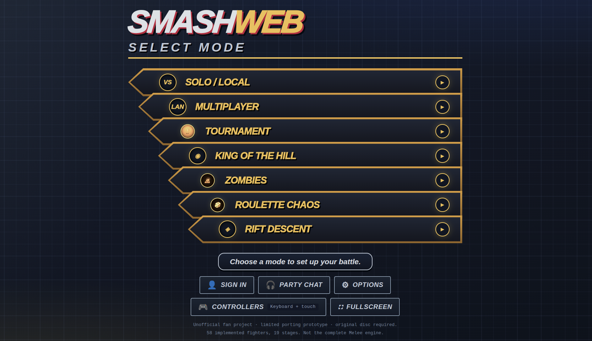

# Smash Web · Port Lab



*Example local installation. Available fighters and stages depend on supplied discs and optional packs; this is a limited prototype, not the complete Melee engine.*

A **non-profit fan project**: an isolated research foundation for a faithful Super Smash Bros. Melee browser port, made by fans, for fans. Unofficial and not affiliated with Nintendo or HAL Laboratory — see the [legal notice](#legal-notice-and-intended-use).

**React scenes and experimental LAN multiplayer are now available.** Choose built-in fighters such as Fox, Mario and Kirby, or an explicitly installed local character pack; select from **nineteen original stages** with original stage music. Play against CPUs with selectable levels 1–9 (see [docs/CPU_AI.md](docs/CPU_AI.md)), share a local keyboard, or join a central-server room with **two to eight browsers** using bounded prediction/rollback. Movement, short/full/double jumps, quick/strong attacks, damage, hitlag, knockback, stocks, respawns, a winner, pause, and rematch work.

This is **not the complete Melee engine**. It combines original disc data and selected original C routines compiled to WebAssembly with prototype match/collision glue. All eight directional specials now work, with native item/effect models and original sound samples. Digital shields, spot/roll/air dodges, grabs/pummels/four throws, and flagged stage ledges are now implemented in the prototype. Cross-character thrown poses and shield visuals are adapted. Full ECB/wall/ceiling collisions, powershields/light shields, DI/SDI, stale moves and the complete particle/TEV/AX systems remain unfinished. Online is a trusted-LAN prototype, not Slippi-compatible or tournament-certified; cross-browser/WAN latency guarantees remain unverified. Optional character packs supply authored gameplay and presentation; their content is not original Melee data. The original-asset viewer and port lab remain available separately.

**KO feedback:** blast-zone deaths use the original disc-loaded beam model, animation and player colors. Hits and KOs use the stage's native camera-quake curves, with bounded prototype strength/viewport mapping. See [scope and tests](docs/KO_EFFECTS.md).

**Samus import:** original model, movement/normals and four prototype specials are available in the candidate source. Tether grabs/recovery, bomb self-jumps, walljumps and Samus particle effects remain unported. See [Samus scope and tests](docs/characters/SAMUS.md). Live service promotion requires a jointly validated frontend/server build.

**Frozen:** an ice-element hit with enough knockback seals the victim in the original ice block instead of launching them: they fall at the lightened ice gravity, tumble with it, mash their way out, and a fire hit thaws them on the spot. See [docs/FROZEN.md](docs/FROZEN.md).

**Shared VFX:** original common-bank hit sparks, fire-hit body flames/color scripts, and authored running/landing dust are now rendered. Non-fire projectiles no longer receive a generic fire halo. This is a bounded particle/TEV subset, not full renderer parity. See [docs/SHARED_VFX.md](docs/SHARED_VFX.md).

## Quick start

You need Node 22.12+, Git, Python 3, Ninja and **your own** Melee USA v1.02 disc image
(nothing from the game is included here). From a fresh clone:

```sh
npm ci
npm run toolchain:setup     # pinned Emscripten, into ignored .local/
npm run upstream:setup      # pinned doldecomp/melee checkout
npm run disc:import -- "/path/to/your/melee-v102.iso"
npm run build               # WASM + typecheck + dist/
npm run serve               # http://127.0.0.1:5273/play.html
```

Details, options and the `.env` settings are in
[Set up your own server from a clone](#set-up-your-own-server-from-a-clone); controls are in
[Run locally](#run-locally); read the [legal notice](#legal-notice-and-intended-use) before
letting anyone else reach your server.

## Community

Questions, feedback and playtests: join the project's Discord — <https://discord.gg/xSczUy8e5>.
It is a fan community; please do not share or ask for disc images, game assets or prebuilt
packages there (see [docs/LEGAL.md](docs/LEGAL.md)).

## Character guides

- [docs/characters/README.md](docs/characters/README.md): process map and delivery criteria.
- [docs/characters/ORIGINAL_ISO.md](docs/characters/ORIGINAL_ISO.md): adding an original fighter from the ISO, with a worked inspection of Captain Falcon.
- [docs/characters/CUSTOM_CHARACTERS.md](docs/characters/CUSTOM_CHARACTERS.md): generating/preparing sprites and creating custom characters, including registration and rollback.
- [examples/characters/training-dummy/pack.json](examples/characters/training-dummy/pack.json): original example pack, with no extracted assets.

Importing a model or supplying images is not enough to get a playable character. The guides separate what the code already supports from the adapters/importers that still have to be written.

## Verified starting point

- Upstream: `doldecomp/melee`, commit `0bac93a5ee2f985dac6220bd36ed7078ae6ac0c9`, pinned in [third_party/melee.lock.json](third_party/melee.lock.json).
- Target: USA v1.02, game ID `GALE01`, disc revision `2`.
- Original and rebuilt executable SHA-1: `08e0bf20134dfcb260699671004527b2d6bb1a45`.
- The pinned GameCube reference build succeeded and matched the supplied executable.
- A 386-byte WASM probe compiles the unchanged [third_party/melee/src/sysdolphin/baselib/random.c](third_party/melee/src/sysdolphin/baselib/random.c) with a narrowly scoped type shim.
- A second 12,777-byte WASM module compiles **33 unmodified original movement/walking/charge/jump/root-motion/hitlag/knockback/damage functions plus the original RNG**, with an explicitly scoped adapter.
- Verification covers production build/typecheck, original gameplay data, input/stock/pause flow, privacy, music, full snapshot/rollback, room security, fullscreen and real multi-browser gameplay. See [docs/REACT_ONLINE.md](docs/REACT_ONLINE.md) for the architecture and full validation commands.
- Scope and provenance: [docs/MILESTONE_03.md](docs/MILESTONE_03.md), [docs/MILESTONE_04.md](docs/MILESTONE_04.md), [docs/MILESTONE_05.md](docs/MILESTONE_05.md), [docs/MILESTONE_06.md](docs/MILESTONE_06.md), [docs/MILESTONE_07.md](docs/MILESTONE_07.md), and [docs/MILESTONE_08.md](docs/MILESTONE_08.md).
- Original assets rendered: fifteen versus stages (including Battlefield, Final Destination and Yoshi's Story), Fox, Mario, and the Mario trophy. See [docs/MILESTONE_02.md](docs/MILESTONE_02.md) and [docs/MENU_AUDIO_STAGES.md](docs/MENU_AUDIO_STAGES.md).

The reference build and the WASM probe are **different targets**. A matching GameCube executable does not imply that the complete game compiles for a browser. RNG replay is not a full-engine determinism proof.

## What is TypeScript and what is C

Almost everything is TypeScript. A small, named set of physics routines is C
compiled to WebAssembly; everything else — the whole roster, the match, the
renderer, the UI and the server — is TypeScript.

| Area | Language | Lines | Share |
| --- | --- | ---: | ---: |
| Tests — [tests/](tests/) | TypeScript | 28,217 | 31.4% |
| Browser app: React screens, Three.js renderer, input — [web/src/](web/src/) | TypeScript | 20,653 | 23.0% |
| **Characters: every fighter, its moves, data and projectiles** — [lib/game/](lib/game/) | TypeScript | 15,234 | 17.0% |
| Shared systems: match flow, collision, items, CPU, physics bridge — [lib/game/](lib/game/) | TypeScript | 13,957 | 15.5% |
| Rift Descent and tournaments — [lib/game/roguelike/](lib/game/roguelike/) | TypeScript | 3,634 | 4.0% |
| Disc/HSD reading and netcode — [lib/](lib/) | TypeScript | 3,292 | 3.7% |
| Game server — [server/](server/) | TypeScript | 2,840 | 3.2% |
| Build scripts and config — [scripts/](scripts/) | TypeScript | 945 | 1.1% |
| Physics routines compiled to WebAssembly (extracted verbatim at build time) | C, unchanged upstream | 576 | 0.6% |
| Adapter ABI and Emscripten shim — [engine/](engine/) | C, written here | 316 | 0.4% |
| Offline service worker — [web/public/sw.js](web/public/sw.js) | JavaScript | 142 | 0.2% |
| **Total** | | **89,806** | **100%** |

So **98.9% of this project is TypeScript**, about **1 line in 100 is C**, and the
only JavaScript is the service worker. Counts are lines in the working tree
(tracked and untracked, ignoring `third_party/`, `node_modules/` and build
output) plus the translation unit generated at build time.

**The C side** (`web/public/wasm/`, built locally by `npm run wasm:build`):

| Module | Size | Contents |
| --- | --- | --- |
| `melee-gameplay.wasm` | 12,777 B | 33 routines — ground/air friction and movement, walk/dash/run/turn, jumps and ascent, fall and fast fall, hitlag, the `KNOCKBACK` macro, damage count and launch angle — plus the pseudo-random number generator |
| `melee-probe.wasm` | 386 B | The generator alone, for the port lab's replay checks |

**That C is used unchanged — not rewritten, not adapted, not "inspired by".**
[scripts/build-gameplay.ts](scripts/build-gameplay.ts) reads the pinned upstream
checkout at build time and copies each routine's source text out byte for byte,
then records its file, name and SHA-256 in `gameplay.build.json`, so any edit
would be visible. The build refuses to run if that checkout sits at a different
revision or carries any local modification (`git rev-parse` +
`git status --porcelain`), and it pins one Emscripten version with
`-fno-fast-math -ffp-contract=off` so the float arithmetic is not quietly
rearranged. Nothing upstream is patched to make it fit: all adapting happens on
this side of the boundary. Provenance and rights are recorded in
[third_party/NOTICE.md](third_party/NOTICE.md).

Around those routines sits ~300 lines of hand-written C in
[engine/](engine/): a private adapter ABI ([engine/gameplay/bridge.h](engine/gameplay/bridge.h),
[engine/gameplay/core.c](engine/gameplay/core.c)) and a type shim for Emscripten
(pinned in [toolchain.lock.json](toolchain.lock.json)). That ABI is a selected
subset, not a full console ABI or SDK replacement.

**The TypeScript side** — 88,772 lines, everything else:

- Match flow, collision resolution, specials, items, projectiles, CPU opponents and Rift Descent ([lib/game/](lib/game/)), which call into the WASM module through [lib/game/physics.ts](lib/game/physics.ts).
- Disc reading and HSD model/animation/audio decoding ([lib/hsd/](lib/hsd/)).
- Three.js rendering, React menus and screens ([web/src/](web/src/)).
- The LAN relay with bounded prediction/rollback ([lib/net/](lib/net/)), and the Node + SQLite server ([server/](server/)): assets, rooms, accounts, cloud saves and public player profiles.

**Every fighter, champion and mod is TypeScript** — 15,234 lines of it, the third
largest area in the table. The compiled C holds no character at all: it is shared
movement, hitlag and knockback math. Each roster entry — the base fighters, the
[ACE 2.0](docs/characters/ACE_FIGHTERS.md) modded fighters (Zero, Sonic, Chun-Li,
Wolf, Charizard and the rest), optional local custom fighters, and Rift
Descent's champions, aspects, relics and boons
([lib/game/roguelike/](lib/game/roguelike/)) — is authored in TypeScript under
[lib/game/](lib/game/), reading its parameters and animations from disc data at
runtime. They all call the same WebAssembly physics through
[lib/game/physics.ts](lib/game/physics.ts); none of them adds or changes a line
of C. Adding a fighter or a mod is therefore pure TypeScript work — see the
[character guides](docs/characters/README.md).

So the C is exactly those 33 physics routines. The match orchestration, collision
glue, roster and presentation around them are prototype TypeScript, as
[docs/ARCHITECTURE.md](docs/ARCHITECTURE.md) describes in detail.

## Optional local character packs

Custom fighters are opt-in, trusted build-time extensions. Their code and assets live in ignored `private/characters/`; the enabled list lives in ignored `.local/character-packs.json`. A fresh clone has no private packs and works without them. The public framework includes an authored, asset-free tutorial:

```sh
npm run packs -- install examples/characters/training-dummy
npm run packs -- enable example.training-dummy
npm run packs -- check
npm run dev
```

See [docs/characters/CUSTOM_CHARACTERS.md](docs/characters/CUSTOM_CHARACTERS.md) for the API, manifests, sprite/physics/state authoring and installation. Protocol **v10** requires identical custom-pack IDs and SHA-256 hashes for joining, spectating and resuming; the relay rejects selecting packs missing from the agreed installation. It does not download mods from peers or provide anti-cheat guarantees.

`SMASH_CHARACTER_PACKS=none` forces a pack-free build without changing your local configuration; `npm run build:public` does the same. Generated WASM still has separate redistribution restrictions. Local packs are Git-private, **not hidden from browsers receiving a pack-enabled build**. Removing formerly tracked content does not erase earlier Git history.

Stage and verify the frontend/relay together before any deployment. This protocol upgrade does not automatically restart the running service.

## Run locally

The LAN game loads its assets automatically from the ISO on the server. No client-side ISO selection or upload is required. For a manual server launch, when the port is free, run from the project root:

```sh
npm run build
npm run serve
```

Open **http://127.0.0.1:5273/play.html**, or use this machine's LAN address on port 5273, then choose **READY TO FIGHT!** or select a stage and enter the arena. Simulation and rendering run in your browser; the server supplies curated assets and separately relays room inputs over WebSocket. The server landing page opens the playable prototype.

- Solo: choose **Fox, Mario, Kirby, or another installed fighter** and a rival. P1 keys and touch buttons control your selected fighter. In two-player mode the selectors choose P1/P2 independently, including mirrors. **Change fighters** returns to selection and resets the match without reloading.
- **P1:** A/D run, **Left Shift + A/D walk**, Space jump, W/S aim, S drop/fast-fall, J/K attacks, **L special**, **U shield/air dodge**, **I grab**.
- **P2:** arrows move/aim/drop, **slash + arrows walk**, **Enter jump**, N/M attacks, **comma special**, **Right Shift shield/air dodge**, **period grab**.
- Direction + special selects up/down/side B; special alone selects neutral. On touch, the stick direction plus B does the same.
- Ground movement follows the original Dash → Run → RunBrake/TurnRun states ([lib/game/locomotion.ts](lib/game/locomotion.ts)): smashing back during a dash re-dashes at once (dash dance), releasing a run skids to a stop that halts at the ledge, pulling back from a run skids before turning, and standing states double their friction above walk speed. Aerials follow the original landing rules for every fighter: script auto-cancel windows, and an L-cancel (shield or grab pressed within 7 frames before touching down) halves the landing lag.
- Quick attack selects jab/dash attack/neutral aerial; tap repeatedly for Mario's three-hit jab or Fox's jab-to-rapid-kick chain. Down+quick selects down tilt/down aerial; down+strong selects down smash/down aerial. Hold down to crouch on solid ground. Hold STRONG for a charged forward smash (or down+STRONG for down smash), then release; aerial strong attacks do not charge. Fox has Blaster, Illusion, Fire Fox, Reflector; Mario has Fireball, Cape, Super Jump Punch, Tornado; Kirby has five air jumps, Inhale (spit/swallow without copy abilities), Hammer, Final Cutter and Stone. Grounded normals honour the original interrupt frame: past it the recovery takes your next input instead of playing out, so tilts, smashes and dash attacks end as early as they do on the disc ([docs/IASA.md](docs/IASA.md)). See [docs/characters/KIRBY.md](docs/characters/KIRBY.md) for Kirby's scope.
- The arena fills the viewport, with HUD portraits, stocks, damage and timer inside the game. The corner **Fullscreen** button requests native fullscreen; **Game options** opens a local pause/settings menu.
- Touch controls are enabled by default on small screens and coarse-pointer devices during a match; desktop players can toggle them. The layout is a floating analog stick (left thumb) plus JUMP / A / SMASH / B / SHIELD / GRAB (right thumb) with slide-between-buttons and multi-touch; portrait phones get a dedicated control panel below the arena, landscape overlays it, and native fullscreen requests a landscape lock on phones.
- **Controllers** opens detection, Xbox/PlayStation/Nintendo layout profiles, player assignment, live input testing and remap/calibration. Pair Bluetooth in the **client device’s OS** first, then press a controller button. Wii/raw/unknown layouts require explicit confirmation or calibration and may need OS drivers; some LAN HTTP browsers deny Gamepad API. Keyboard/touch remain available. See [docs/CONTROLLERS.md](docs/CONTROLLERS.md).
- **Walk mode** in the toolbar forces P1/solo walking, including the touch stick. A gentle gamepad stick walks; a strong deflection runs. Walking uses original acceleration and slow/middle/fast stride animations.
- Shield+down spot dodges; shield+left/right rolls. After grabbing: QUICK pummels, a fresh direction throws. Mash to escape. On a stage ledge: up/in climbs, jump jumps, QUICK attacks, shield rolls, down/out drops. Pass-through platforms have no ledge grabs.
- Esc/focus loss pause **local** games only. Online suspension or disconnect ends the shared match for all peers; Escape never unilaterally pauses online.
- **Original SFX**, **Original music** and the music volume slider independently control original disc samples/tracks. Menu selection/confirm/back, Fox/Mario/Kirby announcements and all three music tracks are prepared before game-ready. Playback unlocks on a browser gesture; browser mixing is not a complete AX hardware emulation.

### Online room

1. Open the same LAN game URL on two to eight browsers. Let original assets finish loading.
2. Choose **Online room**. One player clicks **Create room** and shares the six-character code; others use **Join room**.
3. Each browser chooses a fighter. The host chooses stage, stocks and time. Everyone marks **Ready**; changing selections resets readiness.
4. The host clicks **Start online match**. Every browser uses **P1 controls** for its own assigned slot.
5. The arena shows RTT estimate, prediction depth, rollback count and confirmed frame. **Return to lobby** ends the shared match; readiness must be renewed for a rematch.

The server does not authoritatively simulate gameplay. Peers compare confirmed hashes and stop on divergence. There is no in-progress reconnect, ranked matchmaking or public-Internet deployment hardening. See [docs/REACT_ONLINE.md](docs/REACT_ONLINE.md) and [lib/net/README.md](lib/net/README.md).

The inspection-only viewer remains at http://127.0.0.1:5273/viewer.html and the port lab at http://127.0.0.1:5273/index.html.

For frontend-only development, `npm run dev` uses http://127.0.0.1:5270 and retains the local file picker. A browser never receives unrestricted access to the server's filesystem.

Supply your own lawfully obtained disc and keep it in ignored private storage, outside the web root. Machine-specific tool locations belong only in ignored [.local/toolchain.json](.local/toolchain.json). The setup instructions below do not depend on a prepared workstation.

## Set up your own server from a clone

Every line of this project's own code is in the repository. Three things are
deliberately **not**, and you provide them yourself:

- **The upstream decompilation** (`third_party/melee/`) — fetched at its pinned commit by `npm run upstream:setup`.
- **The WebAssembly modules** (`web/public/wasm/`) — compiled on your machine by `npm run wasm:build`. They are upstream-derived, so this repository ships the build, not the binaries; see [third_party/NOTICE.md](third_party/NOTICE.md).
- **Your own Melee disc**, for anything beyond the probe. No disc image, asset or executable is included here.

Prerequisites: Node 22.13+ (for built-in SQLite without an extra flag), npm, Git, Python 3 and Ninja. The compiler is pinned
to Emscripten **6.0.9** in [toolchain.lock.json](toolchain.lock.json); `npm run
toolchain:setup` installs exactly that version into ignored `.local/emsdk` (set
`EMSDK_DIR` to put it elsewhere), or install it yourself following the
[official instructions](https://emscripten.org/docs/getting_started/downloads.html)
and pick that version rather than an unpinned `latest`.

```sh
npm ci
npm run toolchain:setup   # skips itself when Emscripten 6.0.9 is already available
npm run upstream:setup    # pinned doldecomp/melee checkout
npm run wasm:build        # writes web/public/wasm/
npm run dev               # frontend only, http://127.0.0.1:5270
```

The build looks for `EMCC`, then the optional [.local/toolchain.json](.local/toolchain.json) `emcc` value, then `emcc` on PATH. It rejects a different compiler version, a changed upstream revision, or a modified upstream checkout. The minimal probe requires no disc image.

To serve the game itself, import your disc (next section), then:

```sh
npm run build             # wasm + typecheck + dist/
npm run serve             # 0.0.0.0:5273, see "LAN access" for the safety rules
```

`npm run serve` reads an optional `.env` at the repository root (template:
[.env.example](.env.example)). `SMASH_DISC_SOURCE` decides who supplies the game data:
`server` (default) streams the allowlisted assets of your own ISO and is meant for your
devices and a trusted LAN only; `client` opens no disc on the host, serves no game asset
and makes every player select their own ISO in the browser (`SMASH_CLIENT_ACE` =
`optional`, `required` or `off` controls the ACE 2.0 extension disc). Use `client` for
any host other people can reach — see [docs/LEGAL.md](docs/LEGAL.md).

Server environment: `SMASH_PORT` / `SMASH_HOST` move the listener, `MELEE_ISO`
points at your disc, the optional `MELEE_ACE_ISO` adds the ACE 2.0 extension disc's
fighters (leave it unset for the original roster only), `SMASH_DB_PATH` selects the accounts database (`off`
disables accounts, cloud saves and public profiles — see
[docs/ACCOUNTS.md](docs/ACCOUNTS.md)), `SMASH_PERF_DIR=off` disables
telemetry intake, and `SMASH_ANALYTICS_DB` selects the pseudonymous visit/usage statistics
database (`off` disables it; players can also opt out in Options → Privacy). Keep the database and the disc outside the code directory.

### Import your own disc and verify the reference build

The importer accepts extracted ISO/GCM files, not 7z/RVZ files. It validates the GameCube header, version, bounded filesystem tree, DOL section extents, and expected executable SHA-1 before writing anything. This verifies the executable, not the contents of every asset or a whole-disc checksum.

```sh
npm run disc:import -- "private/disc/Super Smash Bros. Melee (USA) (En,Ja) (v1.02).iso"
npm run reference:build
```

The importer only writes a private metadata report and the reference executable. It does not unpack every asset, duplicate the ISO, upload the disc, or copy game data into the browser bundle. A different existing reference executable is never overwritten.

Results:

- [private/disc-report.json](private/disc-report.json): local disc metadata and file index.
- [third_party/melee/orig/GALE01/sys/main.dol](third_party/melee/orig/GALE01/sys/main.dol): verified original executable.
- [third_party/melee/build/GALE01/main.dol](third_party/melee/build/GALE01/main.dol): upstream GameCube build.
- [private/reference-build.json](private/reference-build.json): original/rebuilt hashes and pinned revision.

The actual pinned build configuration expects the `sys` subdirectory, even though upstream's introductory build instructions currently show an older layout. The first reference build downloads upstream's pinned compiler/tool dependencies. `BUILD_JOBS` defaults to 6; `PYTHON` can select a Python interpreter.

## Checks

```sh
# On another machine, install the browser once:
npx playwright install chromium --only-shell

npm run check
```

Real-disc gameplay unit cases and local-file browser cases are skipped unless `MELEE_DISC_PATH` is set:

```sh
MELEE_DISC_PATH="$PWD/private/disc/Super Smash Bros. Melee (USA) (En,Ja) (v1.02).iso" npm run check
```

Browser tests use port **5272**, independently of the development server. The server-backed integration suite uses **5274** and requires a real ISO configured through `MELEE_DISC_PATH`, `MELEE_ISO`, or the private import report:

```sh
npm run test:server-browser
```

It verifies automatic loading without a browser file, partial animation reads, client-side frame rendering, actual gameplay inputs/damage/stock flow, forbidden endpoints, and optional local-source fallback. Set `SMASH_PLAY_ARTIFACT_DIR` for playable screenshots. Set `SMASH_SERVER_ARTIFACT_DIR` to save its screenshots outside the repository. On this workstation, [.local/toolchain.json](.local/toolchain.json) also supplies an isolated `playwrightExecutable`; elsewhere Playwright uses its normal browser installation. Set `SMASH_ARTIFACT_DIR` to choose an external screenshot directory; otherwise test artifacts stay in ignored [test-results/](test-results/).

Tests cover malformed/truncated disc and HSD data, filesystem bounds and unsafe names, version/SHA-1 rejection, GX tiled texture formats, primitive decoding, clockwise GX culling, animation number formats and Hermite slopes, 50,000 integer RNG transitions, RNG state restore, and module isolation. Browser checks cover real textured scenes, repeatable pose seeking, multiple stages, four-model rendering, screenshot download, mobile layout, failure messages, and private-file serving restrictions. Set `SMASH_RENDER_ARTIFACT_DIR` to store rendering screenshots outside the repository.

```sh
npm run build
npm run preview
```

The static preview listens on http://127.0.0.1:5271; the viewer is at http://127.0.0.1:5271/viewer.html. Only [dist/](dist/) is a web deployment output. **Do not serve the repository root.**

## LAN access

`npm run serve` listens on **0.0.0.0:5273** by default. Open `http://<this-machine-LAN-IP>:5273/play.html` from another device; it loads the prototype automatically from the server's disc and waits for Start match. `MELEE_ISO` selects an explicit ISO path; otherwise the server uses the path recorded in [private/disc-report.json](private/disc-report.json). `SMASH_HOST` and `SMASH_PORT` override the bind address and port.

Only TCP port 5273 needs to be allowed through the host firewall. Firewall changes require separate administrator authorization. This is a **trusted-LAN service without authentication**, designed exclusively for a private local network. Do not deploy it to a public host, public IP, cloud service, Internet-accessible tunnel, or otherwise expose it to the public Internet. Clients can save the assets they receive. The entire ISO, executable, unrelated disc files, and private directories have no public endpoint.

`npm run preview:lan` remains available as a static-only preview; unlike `npm run serve`, it has no server ISO source and requires a local ISO in each browser. See [docs/SERVER_SOURCE.md](docs/SERVER_SOURCE.md) for the API, bounds, and configuration.

Ordinary HTTP LAN addresses are not browser secure contexts. [lib/checksum.ts](lib/checksum.ts) therefore uses a local SHA-1 fallback when Web Crypto is unavailable; both paths are checked against the same upstream executable checksum. SHA-1 is used only for legacy file identification, not authentication. HTTPS would still be required for future secure-context-only browser features.

## Architecture and next milestone

- [docs/PORTABILITY.md](docs/PORTABILITY.md): initial source audit, verified scope, and known obstacles.
- [docs/ARCHITECTURE.md](docs/ARCHITECTURE.md): C/WASM boundaries and the eight-player central-server prototype.
- [docs/SERVER_SOURCE.md](docs/SERVER_SOURCE.md): server-side ISO loading with browser-side rendering.
- [docs/PERFORMANCE.md](docs/PERFORMANCE.md): CPU/resource optimization pass, graphics quality presets (Low/Medium/High/Extra high in Game options), measured effect, verified invariants, and open items.

Milestone 02 now uses **Three.js as an isolated asset-inspection renderer**, with a bounded HSD parser, GX texture/display-list decoding, skin envelopes, and original animation playback. It is not a replacement implementation of Melee's gameplay or the complete GX/TEV pipeline. The existing native/Aurora direction remains a separate candidate for the full game backend.

Milestone 03 adds a restricted two-fighter local match using original attributes, hit/hurt definitions, Battlefield collision/blast data, and selected C physics/knockback routines. Match state flow, collision resolution, CPU behavior (levels follow the original CPU ladder; decisions are prototype code, see [docs/CPU_AI.md](docs/CPU_AI.md)), and presentation remain prototype adapters rather than the full original engine.

Next: verify browser numerical equivalence and real-device/WAN latency; continue original state/ECB collisions, recovery mechanics and rendering fidelity. React scenes, eight-fighter simulation and central-server bounded rollback are implemented for the limited prototype, not as proof of full original-engine fidelity.

## Credits

- **Melee decompilation** — research and function extraction read the pinned [doldecomp/melee](https://github.com/doldecomp/melee) checkout (`0bac93a5ee2f985dac6220bd36ed7078ae6ac0c9`, see [third_party/melee.lock.json](third_party/melee.lock.json)). The upstream tree stays unchanged.
- **ACE 2.0** — the Akaneia-fork m-ex build (`Chri222k/ACE-BUILD-PUBLIC-`) supplies the modded-fighter reference data (Zero, Toad, Meta Knight, Sonic, Raichu, Charizard, Wolf, Diddy Kong, King Dedede, Wario, Shadow, Blastoise, Lucas, Metal Sonic, Ninten, Daisy, Fay, Sonic BM, Dr. Luigi, Knuckles, Lucina, Lucas TDX, Shadow Mewtwo, Luigi & Boo, Metal Mario, Skull Kid, Chun-Li, Giga Bowser, Tails, Blood Falcon, Wolf SSBU); the extension disc is read locally at the owner's request and never redistributed.
- **Thank you, ACE team and Team Akaneia** — every modded fighter in this roster exists because of the ACE 2.0 build by Chri222k and the ACE contributors, which itself stands on Team Akaneia's Akaneia build and the m-ex framework. Their characters, animations and move design are their work; this project claims no authorship of them.
- **Format research** — HSD/archive interpretation follows noclip.website; audio decoding follows vgmstream. Full notices: [third_party/NOTICE.md](third_party/NOTICE.md).

Non-profit fan project and independent research prototype, not affiliated with Nintendo, HAL Laboratory, or the credited projects. Public source availability does not grant redistribution rights.

## Legal notice and intended use

This is a non-profit fan project: an independent, unofficial research effort made
by fans out of appreciation for the original game. It is not affiliated with,
authorized by, sponsored by, or endorsed by Nintendo, HAL Laboratory, or any
other relevant rightsholder.

This repository does not grant permission to distribute copyrighted game code,
assets, music, models, animations, disc images, or other material owned by third
parties. Publicly hosting this project with access to assets from a game disc,
or distributing generated builds containing third-party code or assets, may
infringe copyright and other applicable rights.

The project is intended for private, noncommercial research using a lawfully
obtained copy of the game. The recommended configuration runs locally on your
own computer and requires each user to provide their own legitimately acquired
disc data. Laws and exceptions vary by jurisdiction; users are responsible for
ensuring that their use complies with applicable law and licenses.

Operators and contributors: read [docs/LEGAL.md](docs/LEGAL.md) before letting anyone
else reach a host. It covers the two disc modes, the compiled-WASM question, multiplayer
and tournaments, personal data (accounts, telemetry, voice), rightsholder requests and the
warranty disclaimer. It is practical guidance, not legal advice, and no notice in this
repository makes an infringing use lawful.

Do not:

- expose the ISO-backed asset server (`SMASH_DISC_SOURCE=server`) to the public
  Internet; hosts that other people can reach must run `SMASH_DISC_SOURCE=client`;
- link to, host, or accept uploads of disc images;
- run public, advertised or prize tournaments on this software, or present it as an
  official or licensed product;
- distribute disc images, extracted assets, asset caches, generated WASM, or
  prebuilt packages containing third-party material;
- use the project to provide game assets to users who have not supplied their
  own lawful copy; or
- sell access to the project or monetize third-party intellectual property.

All trademarks and character, stage and music names belong to their respective owners
and are used only to describe compatibility. The software is provided "as is", without
warranty of any kind, including non-infringement; each user and operator is solely
responsible for their own use. Rightsholders may contact the repository owner or the
operator of a host; requests from the owners of the game are honoured promptly and are
not contested.

## Licence

The project's own source code, scripts and documentation are licensed under the
[PolyForm Noncommercial License 1.0.0](LICENSE.md): you may use, study, modify and share
them for any **noncommercial** purpose, keeping the required notice. Commercial use is
not permitted. The licence covers nothing owned by third parties — no game disc, asset,
original executable, decompilation-derived build (including the gameplay WASM), ACE 2.0
content or trademark; those keep their owners' terms
([third_party/NOTICE.md](third_party/NOTICE.md), [docs/LEGAL.md](docs/LEGAL.md)).

## Privacy and rights

[private/](private/), [third_party/melee/](third_party/melee/), generated WASM, local tool configuration, and disc/archive formats are excluded by [.gitignore](.gitignore). [vite.config.ts](vite.config.ts) separately restricts filesystem serving; Git ignore rules are not access control. The normal development/preview commands bind only to loopback. The LAN server exposes the built app and a narrowly allowlisted, read-only asset API on all IPv4 interfaces. It does not serve the repository root or the full disc.

Software credits and applicable renderer licenses are recorded in [third_party/NOTICE.md](third_party/NOTICE.md) and included in the browser distribution. No disc image, texture, model, animation, audio, or reference executable is bundled into the static app. In server mode, selected model/texture/animation archives are delivered separately at runtime at the user's request. Compiled upstream code still has a separate rights/licensing question: public source availability and ownership of a disc do not automatically authorize redistribution. No upstream material is relicensed here. Do not publish compiled artifacts or copyrighted assets without reviewing the applicable rights. This project is not affiliated with Nintendo or HAL Laboratory.
